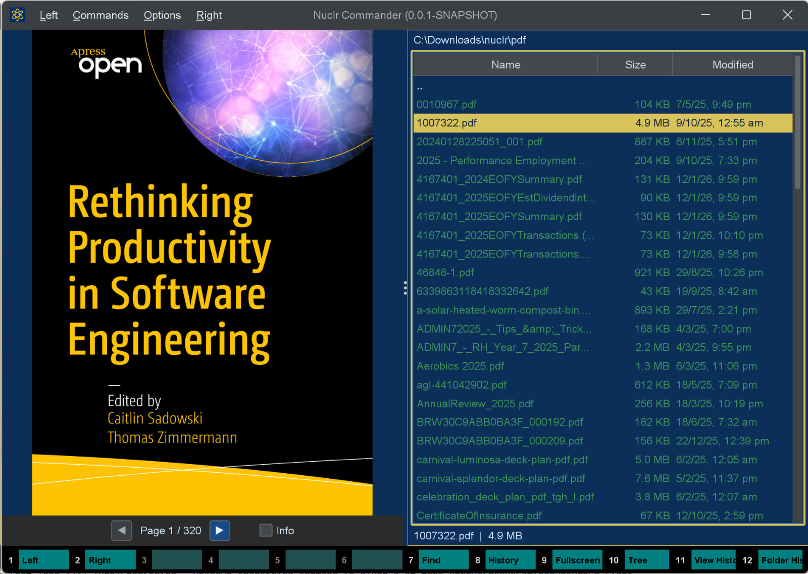

# 📄 PDF Quick Viewer

A [Nuclr Commander](https://nuclr.dev) plugin that renders PDF files directly in the quick-view panel. Press **Ctrl+Q** on any `.pdf` file to preview it without leaving the file manager.

---

## 🖼️ Preview



---

## ✨ Features

- **Page-accurate rendering** — every page is rasterized to a crisp RGB image via Apache PDFBox
- **Page navigation** — move between pages with on-screen buttons, keyboard shortcuts, or a direct page-number jump
- **Zoom & pan** — `Ctrl`+scroll zooms with the page point under the cursor anchored; drag to pan when zoomed. Zoom and pan reset on every page change
- **Info overlay** — semi-transparent HUD showing title, author, page count, PDF version, and render DPI
- **LRU page cache** — recently viewed pages are kept in memory so navigation feels instant
- **Cancellation-aware** — switching files mid-render immediately aborts the in-flight job; no stale frames ever reach the UI
- **Encrypted PDF handling** — password-protected files display a clear message instead of crashing
- **JBIG2 support** — bundled `jbig2-imageio` allows PDFBox to render scanned PDFs that use JBIG2-compressed images
- **Optional CLI backends** — can delegate rendering to MuPDF, Poppler, or Ghostscript when installed; falls back to PDFBox automatically on any failure
- **Persistent settings** — DPI, overlay toggle, and backend choice survive restarts

---

## ⌨️ Keyboard Shortcuts

| Key | Action |
|-----|--------|
| `←` / `↑` / `Page Up` | Previous page |
| `→` / `↓` / `Page Down` | Next page |
| `Home` | First page |
| `End` | Last page |
| `Ctrl+G` | Prompt for a page number and jump within the valid range |
| `Ctrl` + scroll | Zoom in / out |
| Mouse drag | Pan (only when zoomed in) |

> The quick-view panel must have focus for keyboard shortcuts to work. Click the panel or press **Ctrl+Q** to focus it.

---

## ⚙️ Settings

Settings are stored as a plain `.properties` file in the platform config directory:

| Platform | Path |
|----------|------|
| Windows | `%APPDATA%\nuclr\pdf-quick-viewer.properties` |
| macOS | `~/Library/Application Support/nuclr/pdf-quick-viewer.properties` |
| Linux | `$XDG_CONFIG_HOME/nuclr/pdf-quick-viewer.properties` (or `~/.config/nuclr/`) |

| Key | Default | Description |
|-----|---------|-------------|
| `pdf.quickView.dpi` | `144` | Render resolution. Range: 36–200. |
| `pdf.quickView.cachePages` | `10` | Maximum rendered pages in the LRU cache. |
| `pdf.quickView.showInfoOverlay` | `true` | Show the semi-transparent info panel. |
| `pdf.quickView.backend` | `PDFBOX` | Rendering backend (see table below). |

### 🔌 Backends

| Value | Description |
|-------|-------------|
| `PDFBOX` | Apache PDFBox — pure Java, always available. **Recommended.** |
| `AUTO` | Try CLI tools in order (MuPDF → Poppler → Ghostscript); fall back to PDFBox. |
| `CLI_MuTool` | MuPDF `mutool draw`. Requires `mutool` on `PATH`. |
| `CLI_POPPLER` | Poppler `pdftocairo` or `pdftoppm`. Requires Poppler on `PATH`. |
| `CLI_GS` | Ghostscript `gs`. Requires Ghostscript on `PATH`. |

---

## 📥 Installation

Copy the signed plugin archive and detached signature into the Nuclr Commander `plugins/` directory:

```text
quick-view-pdf-<version>.zip
quick-view-pdf-<version>.zip.sig
```

Nuclr Commander verifies the RSA-SHA256 signature against `nuclr-cert.pem` on load. The plugin becomes available immediately without a restart.

---

## 🧱 Architecture

```text
PdfQuickViewProvider          implements QuickViewNuclrPlugin
└── PdfQuickViewPanel         Swing JPanel — all state is EDT-only
    └── PdfRenderService      virtual-thread orchestrator
        ├── PdfPageCache      thread-safe LRU (LinkedHashMap, access-order)
        ├── PdfSettings       singleton — java.util.Properties persistence
        └── backend/
            ├── PdfRenderBackend   strategy interface
            ├── PdfboxBackend      Apache PDFBox 3.x (default)
            └── CliBackend         MuPDF / Poppler / Ghostscript
```

### 🧵 Threading model

- **EDT** — UI state reads/writes, Swing repaints, button callbacks
- **Virtual threads** (`Thread.ofVirtual()`) — byte reading, document opening, page rendering
- **Cancellation** — a monotonic `AtomicLong` epoch is incremented on every new request; stale results are silently discarded
- **Backend lock** — a `ReentrantLock` serializes `openDocument` and `renderPage` to prevent concurrent access to a non-thread-safe `PDFRenderer`

---

## 📚 Dependencies

| Library | Version | Purpose |
|---|---|---|
| `dev.nuclr:platform-sdk` | `3.0.1` | Nuclr platform interfaces |
| `pdfbox` | `3.0.7` | PDF rendering (Apache PDFBox) |
| `pdfbox-io` | `3.0.7` | PDFBox I/O utilities |
| `fontbox` | `3.0.7` | Font handling for PDFBox |
| `commons-logging` | `1.3.5` | Logging bridge |
| `jbig2-imageio` | `3.0.4` | JBIG2-compressed image support |

---

## 📜 License

Apache 2.0 — see [LICENSE](LICENSE).
